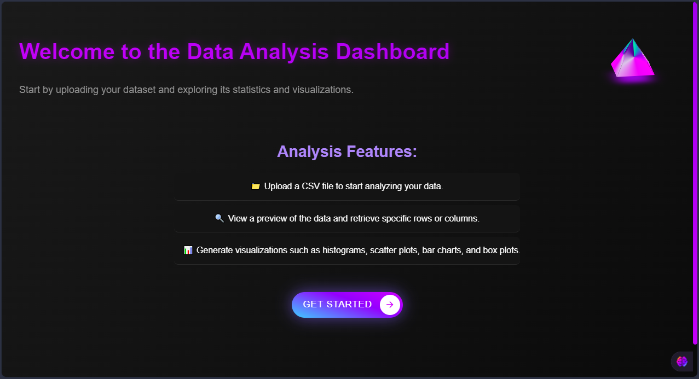

# 📊 Data Visualization Dashboard

An interactive web application for uploading CSV files, performing statistical analysis, and generating data visualizations.

## ✨ Features

- 📁 Upload CSV files and preview the first 5 rows.
- 🔍 Access specific rows and columns using simple inputs.
- 📈 Perform statistical analysis (mean, median, standard deviation, etc.).
- 📊 Generate interactive visualizations (histograms, scatter plots, bar charts, and box plots).
- 🔄 Seamless navigation between upload and visualization pages.
- 🌙 Clean, responsive dark mode theme with a neon violet accent.

## 🛠️ Installation

Follow these steps to set up the project on your local machine:

1. Clone the repository:
    ```bash
    git clone https://github.com/your-username/repository-name.git
    ```
2. Navigate to the project directory:
    ```bash
    cd repository-name
    ```
3. Create a virtual environment and activate it:
    ```bash
    python -m venv venv
    source venv/bin/activate  # On Windows: venv\Scripts\activate
    ```
4. Install the required packages:
    ```bash
    pip install -r requirements.txt
    ```
5. Apply migrations:
    ```bash
    python manage.py migrate
    ```
6. Run the development server:
    ```bash
    python manage.py runserver
    ```

## 🚀 Usage

1. Navigate to the homepage:
    - Open your browser and go to `http://127.0.0.1:8000/`.
2. Upload your CSV file:
    - Click **"Go to Upload Page"**, select your CSV file, and upload it.
3. Explore your data:
    - Use the options to preview data, access rows/columns, or perform statistical analysis.
4. Visualize your data:
    - Navigate to the visualization page and generate interactive charts.

## 🌟 Main Features

1. **File Upload and Data Preview:**
    - Supports CSV files with numeric and textual columns.
    - Displays a preview of the first 5 rows.

2. **Row and Column Indexing:**
    - Retrieve specific rows by index and columns by name.

3. **Statistical Analysis:**
    - Calculate mean, median, standard deviation, and more.

4. **Interactive Visualizations:**
    - Generate histograms, scatter plots, bar charts, and box plots with zooming and filtering.

5. **Responsive Design:**
    - Dark mode theme with a neon violet accent.

## 📁 Project Structure

```
repository-name/
    ├── analysis/
    │   ├── migrations/           # Database migration files
    │   ├── static/               # Static files (CSS, JS, images)
    │   │   └── analysis/
    │   │       ├── styles.css    # Main stylesheet
    │   │       └── favicon.ico   # Website icon
    │   ├── templates/            # HTML templates
    │   │   ├── homepage.html
    │   │   ├── upload.html
    │   │   └── visualization.html
    │   ├── __init__.py           # App initialization file
    │   ├── admin.py              # Admin configurations
    │   ├── apps.py               # App configurations
    │   ├── forms.py              # Django forms
    │   ├── models.py             # Database models
    │   ├── tests.py              # Unit tests
    │   ├── urls.py               # App-specific routes
    │   └── views.py              # App logic and views
    ├── data_final_Project/       # Project-level settings and routes
    │   ├── __init__.py
    │   ├── asgi.py
    │   ├── settings.py
    │   ├── urls.py
    │   └── wsgi.py
    ├── db.sqlite3                # SQLite database file
    ├── manage.py                 # Django management script
    ├── requirements.txt          # Python dependencies
    └── README.md                 # Project documentation
```
